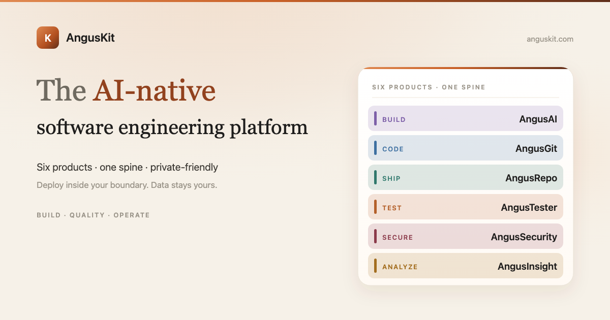

**English** | [简体中文](README.zh.md)

<p align="center">
  
</p>

<p align="center">
  <a href="https://www.anguskit.com/en/pricing"></a>
  <a href="LICENSE"></a>
  <a href="https://www.anguskit.com/en/docs/kit"></a>
  <a href="https://www.anguskit.com"></a>
</p>

# AngusKit

AI-Native Software Engineering Platform.

> **This repository hosts documentation only.** AngusKit source code is distributed through private deployment packages, not through this GitHub repository. Earlier revisions of this repository contained application source; as of this update, distribution has moved to AngusKit's packaging pipeline (see [Get the Community Edition](#get-the-community-edition-free) below) to keep versioning, licensing, and edition builds consistent across all seven applications. This repository now focuses on product information, quickstart guides, and links to the full documentation site.

## What is AngusKit

AngusKit is a private, self-hosted software engineering suite: one shared identity/governance layer (AngusGM) plus six purpose-built products — AI agent development, code collaboration, artifact management, testing, security, and product analytics. Instead of assembling separate open-source tools and stitching together auth, permissions, and audit trails yourself, AngusKit ships them as one consistent, deployable bundle that stays inside your own infrastructure.

It is **not** an eighth product bolted onto the other six — it is the distribution unit that packages AngusGM with any combination of the six business applications into a single install.

## The six products

| Product | Focus | Repository |
|---|---|---|
| **AngusAI** | AI agent development — build, host, and publish agents | [AngusKit/AngusAI](https://github.com/AngusKit/AngusAI) |
| **AngusGit** | AI-native code collaboration — repos, PRs, reviews, CICD | [AngusKit/AngusGit](https://github.com/AngusKit/AngusGit) |
| **AngusRepo** | Universal artifact management — 10 protocols, one repo | [AngusKit/AngusRepo](https://github.com/AngusKit/AngusRepo) |
| **AngusTester** | AI-native software testing — one YAML engine for everything | [AngusKit/AngusTester](https://github.com/AngusKit/AngusTester) |
| **AngusSecurity** | Application security & governance — SAST, secrets, SCA, gates | [AngusKit/AngusSecurity](https://github.com/AngusKit/AngusSecurity) |
| **AngusInsight** | Private product analytics — usage insight without leaving your infra | [AngusKit/AngusInsight](https://github.com/AngusKit/AngusInsight) |

Each product also has its own repository (linked above) with a product-specific README, screenshots, and quickstart. This repository is the entry point for the **whole suite**.

## Get the Community Edition (free)

The Community Edition of the full suite is free, self-hosted, and unlimited in time. Minimum footprint for evaluating a single product is 2 cores / 4 GB; running the **full 7-process suite** (GM + all six products + database) needs **8 cores / 16 GB** minimum (16 cores / 32 GB recommended).

```bash
curl -LO https://repo.anguskit.com/raw/raw-public/AngusKit/kit/AngusKit-Community-1.0.0.zip
unzip AngusKit-Community-1.0.0.zip
cd AngusKit-1.0.0/docker
cp env.example .env
docker compose --profile mysql up -d
```

Default ports after install:

| App | Port |
|---|---|
| AngusGM (sign-in) | 8801 |
| AngusAI | 8802 |
| AngusGit (HTTP) / SSH | 8803 / 2222 |
| AngusRepo | 8804 |
| AngusTester | 8807 |
| AngusInsight | 8808 |
| AngusSecurity | 8809 |

Only need one or two products instead of the full suite? Download that product's own SKU zip from its repository above — same packaging pipeline, smaller footprint.

Full installation guide (host ZIP, Kubernetes/Helm, TLS, upgrades, backup): **[docs.anguskit.com/kit](https://www.anguskit.com/en/docs/kit/latest/en/manual/02-install-deploy)**

## Community vs. Team / Enterprise vs. SaaS

| | Community | Team / Enterprise | SaaS |
|---|---|---|---|
| Price | Free | Paid, private deployment | Paid, hosted |
| Users | Up to 10 (shared pool) | Higher / unlimited seats | Per plan |
| MCP / AI toolchain access | Not included | Included | Per plan |
| Advanced security, SSO, audit | Not included | Included | Per plan |
| Support | Community | SLA-backed | SLA-backed |

Community Edition source (per product) is licensed under GPL-3.0 and distributed with each Community installation package. Team and Enterprise editions are proprietary, governed by the **XCan Business License, Version 1.0**, and are only distributed under a paid subscription — their source is not published in this repository.

Full pricing, feature comparison, and SaaS availability by product: **[anguskit.com/pricing](https://www.anguskit.com/en/pricing)**

## Documentation & support

- Full docs: [anguskit.com/docs/kit](https://www.anguskit.com/en/docs/kit)
- Contact / sales: [anguskit.com/contact](https://www.anguskit.com/en/contact) · `sales@anguskit.com`
- This repository's Issues are for **documentation feedback and install troubleshooting** for the suite as a whole. Product-specific issues belong in that product's own repository (see table above). This repository does not accept source code pull requests — see [CONTRIBUTING.md](CONTRIBUTING.md).

## License

- This repository's documentation content: see [LICENSE](LICENSE) (GPL-3.0, matching the Community Edition source it describes).
- AngusKit Community Edition product source: GPL-3.0, distributed with each Community installation package.
- AngusKit Team / Enterprise Edition: proprietary, XCan Business License v1.0, distributed under a paid subscription only.
