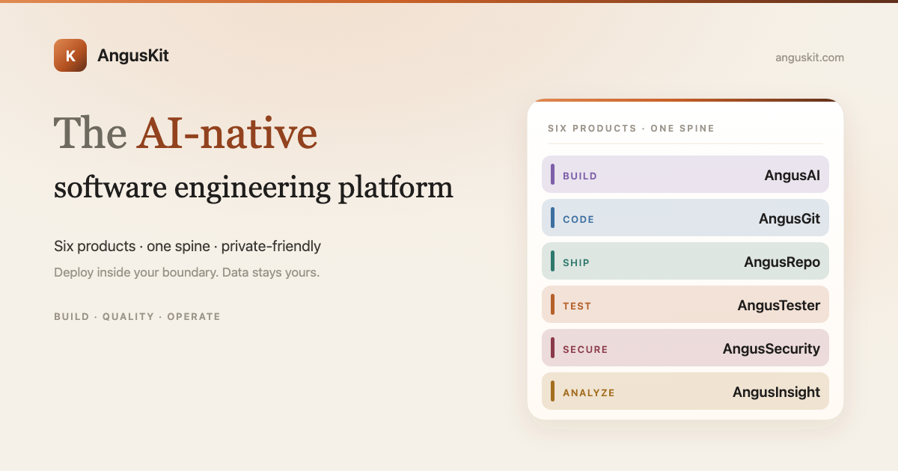

**English** | [简体中文](README.zh.md)

<p align="center">
  
</p>

<p align="center">
  <a href="https://www.anguskit.com/en/pricing"></a>
  <a href="LICENSE"></a>
  <a href="https://www.anguskit.com/en/docs/kit"></a>
  <a href="https://www.anguskit.com"></a>
</p>

# AngusKit

AI-Native Software Engineering Platform.

> **This repository hosts documentation only.** AngusKit source code is distributed through private deployment packages, not through this GitHub repository. Earlier revisions of this repository contained application source; as of this update, distribution has moved to AngusKit's packaging pipeline (see [Get the Community Edition](#get-the-community-edition-free) below) to keep versioning, licensing, and edition builds consistent across all seven applications. This repository now focuses on product information, quickstart guides, and links to the full documentation site.

## What is AngusKit

AngusKit is a private, self-hosted software engineering suite: one shared identity/governance layer (AngusGM) plus six purpose-built products — AI agent development, code collaboration, artifact management, testing, security, and product analytics. Instead of assembling separate open-source tools and stitching together auth, permissions, and audit trails yourself, AngusKit ships them as one consistent, deployable bundle that stays inside your own infrastructure.

It is **not** an eighth product bolted onto the other six — it is the distribution unit that packages AngusGM with any combination of the six business applications into a single install.

## The six products

| Product | Focus | Repository |
|---|---|---|
| **AngusAI** | AI agent development — build, host, and publish agents | [AngusKit/AngusAI](https://github.com/AngusKit/AngusAI) |
| **AngusGit** | AI-native code collaboration — repos, PRs, reviews, CICD | [AngusKit/AngusGit](https://github.com/AngusKit/AngusGit) |
| **AngusRepo** | Universal artifact management — 10 protocols, one repo | [AngusKit/AngusRepo](https://github.com/AngusKit/AngusRepo) |
| **AngusTester** | AI-native software testing — one YAML engine for everything | [AngusKit/AngusTester](https://github.com/AngusKit/AngusTester) |
| **AngusSecurity** | Application security & governance — SAST, secrets, SCA, gates | [AngusKit/AngusSecurity](https://github.com/AngusKit/AngusSecurity) |
| **AngusInsight** | Private product analytics — usage insight without leaving your infra | [AngusKit/AngusInsight](https://github.com/AngusKit/AngusInsight) |

Each product also has its own repository (linked above) with a product-specific README, screenshots, and quickstart. This repository is the entry point for the **whole suite**.

## Get the Community Edition (free)

About **1 GB**. Full suite: AngusGM + six products. At least **8 cores / 16 GB** RAM and **200 GB** disk. Docker Engine + Compose v2.

This first-run path matches the official docs: Docker Compose, the install wizard, **access mode 2** (bundled Caddy), HTTP `:80` (no certificate).

1. Resolve names to this machine (or add to `/etc/hosts` for a local trial). Public DNS name in the wizard is the **suffix** (e.g. `example.com`), not `gm.example.com`.

```bash
127.0.0.1 gm.example.com ai.example.com git.example.com repo.example.com tester.example.com insight.example.com security.example.com
```

Open host **80**. Open **2222** only for Git SSH, **7100** only for a Tester agent. App ports stay behind the proxy — do not use `localhost:8801`. Stop Nginx/Caddy/IIS if they already bind 80. On macOS + Docker Desktop, do not run `./install.sh` with `sudo`.

2. Download, unzip, and run the wizard from the package root:

```bash
curl --fail --location --progress-bar -o AngusKit-Community-1.0.0.zip \
  https://repo.anguskit.com/raw/raw-public/AngusKit/kit/AngusKit-Community-1.0.0.zip
unzip AngusKit-Community-1.0.0.zip
cd AngusKit-1.0.0
./install.sh
```

Answer: Install mode `1` (Compose) → Access **`2`** (bundled reverse proxy — do not press Enter) → Proxy `1` (Caddy) → TLS **`4`** (HTTP `:80`, no certificate) → Database `1` (MySQL 8 in Compose) → Public DNS name = `example.com` → set admin password (default user `admin`). Wait for `Install finished.`

3. Confirm health, then open the console:

```bash
./bin/angusctl.sh doctor
```

Look for `doctor: OK`. Open `http://gm.example.com/` (use your DNS suffix) and sign in. The portal lists all six products.

Only need one or two products? Download that product’s own SKU zip from its repository — same wizard, smaller footprint.

First-run guide: **[kit quickstart](https://www.anguskit.com/en/docs/kit/get-started/quickstart)** · Full install (host ZIP, Helm preview, TLS, offline): **[install docs](https://www.anguskit.com/en/docs/kit/latest/en/manual/04-install-deploy/install)**

## Community vs. Team / Enterprise vs. SaaS

| | Community | Team / Enterprise | SaaS |
|---|---|---|---|
| Price | Free | Paid, private deployment | Paid, hosted |
| Users | Up to 10 (shared pool) | Higher / unlimited seats | Per plan |
| MCP / AI toolchain access | Not included | Included | Per plan |
| Advanced security, SSO, audit | Not included | Included | Per plan |
| Support | Community | SLA-backed | SLA-backed |

Community Edition source (per product) is licensed under GPL-3.0 and distributed with each Community installation package. Team and Enterprise editions are proprietary, governed by the **[XCan Business License, Version 1.0](https://www.anguskit.com/licenses/XCBL-1.0)** (XCBL-1.0), and are only distributed under a paid subscription — their source is not published in this repository.

Full pricing, feature comparison, and SaaS availability by product: **[anguskit.com/pricing](https://www.anguskit.com/en/pricing)**

## Documentation & support

- Full docs: [anguskit.com/docs/kit](https://www.anguskit.com/en/docs/kit)
- Contact / sales: [anguskit.com/contact](https://www.anguskit.com/en/contact) · `sales@anguskit.com`
- This repository's Issues are for **documentation feedback and install troubleshooting** for the suite as a whole. Product-specific issues belong in that product's own repository (see table above). This repository does not accept source code pull requests — see [CONTRIBUTING.md](CONTRIBUTING.md).

## License

- This repository's documentation content: see [LICENSE](LICENSE) (GPL-3.0, matching the Community Edition source it describes).
- AngusKit Community Edition product source: GPL-3.0, distributed with each Community installation package.
- AngusKit Team / Enterprise Edition: proprietary, [XCan Business License, Version 1.0](LICENSE-XCBL-1.0) (XCBL-1.0) — see https://www.anguskit.com/licenses/XCBL-1.0. Distributed under a paid subscription only.
