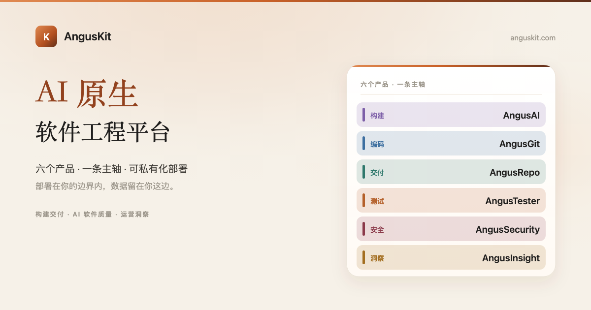

[English](README.md) | **简体中文**

<p align="center">
  
</p>

<p align="center">
  <a href="https://www.anguskit.com/zh/pricing"></a>
  <a href="LICENSE"></a>
  <a href="https://www.anguskit.com/zh/docs/kit"></a>
  <a href="https://www.anguskit.com"></a>
</p>

# AngusKit

AI 原生软件工程平台。

> **本仓库仅承载文档内容。** AngusKit 的产品源码通过私有化安装包分发，不在本 GitHub 仓库公开。本仓库此前版本曾包含应用源码；本次更新后，源码分发已统一收拢到 AngusKit 的打包发布流水线（见下文「免费获取社区版」），以保证七个应用之间的版本、许可证与版次构建口径一致。本仓库现聚焦于产品信息、快速上手指引，以及指向完整文档站的链接。

## AngusKit 是什么

AngusKit 是一套私有化、自托管的软件工程套件：一层统一身份与治理底座（AngusGM），加上六个针对性构建的产品——AI 智能体开发、代码协作、制品管理、测试、安全与产品分析。你不需要自己拼装一堆开源工具再手工打通登录、权限与审计链路，AngusKit 把它们打成一套口径一致、可直接部署的发行物，全程留在你自己的基础设施内。

它**不是**在原有六个产品之外硬塞的第七个产品，而是把 AngusGM 与六个业务产品任意组合打进同一份安装包的**分发单位**。

## 六个产品

| 产品 | 定位 | 仓库 |
|---|---|---|
| **AngusAI** | AI 智能体开发——搭建、托管、发布智能体 | [AngusKit/AngusAI](https://github.com/AngusKit/AngusAI) |
| **AngusGit** | AI 原生代码协作——仓库、合并请求、评审、CICD | [AngusKit/AngusGit](https://github.com/AngusKit/AngusGit) |
| **AngusRepo** | 通用制品管理——10 种协议统一托管 | [AngusKit/AngusRepo](https://github.com/AngusKit/AngusRepo) |
| **AngusTester** | AI 原生软件测试——一种 YAML 引擎测遍所有场景 | [AngusKit/AngusTester](https://github.com/AngusKit/AngusTester) |
| **AngusSecurity** | 应用安全与治理——SAST、密钥、SCA、门禁 | [AngusKit/AngusSecurity](https://github.com/AngusKit/AngusSecurity) |
| **AngusInsight** | 私有化产品分析——不出域的使用洞察 | [AngusKit/AngusInsight](https://github.com/AngusKit/AngusInsight) |

每个产品都有自己的仓库（见上表链接），各自带产品级 README、截图与快速上手。本仓库是**整套套件**的入口。

## 免费获取社区版

整套套件的社区版免费、自托管、无使用期限。评估单个产品最低 2 核/4 GB；跑**全套 7 进程**（GM + 六个产品 + 数据库）最低需要 **8 核/16 GB**（推荐 16 核/32 GB）。

```bash
curl -LO https://repo.anguskit.com/raw/raw-public/AngusKit/kit/AngusKit-Community-1.0.0.zip
unzip AngusKit-Community-1.0.0.zip
cd AngusKit-1.0.0/docker
cp env.example .env
docker compose --profile mysql up -d
```

安装完成后的默认端口：

| 应用 | 端口 |
|---|---|
| AngusGM（登录入口） | 8801 |
| AngusAI | 8802 |
| AngusGit（HTTP）/ SSH | 8803 / 2222 |
| AngusRepo | 8804 |
| AngusTester | 8807 |
| AngusInsight | 8808 |
| AngusSecurity | 8809 |

只需要一两个产品而不是整套？从上表对应仓库下载该产品自己的 SKU 安装包——打包流水线相同，资源占用更小。

完整安装指南（主机 ZIP、Kubernetes/Helm、TLS、升级、备份）：**[docs.anguskit.com/kit](https://www.anguskit.com/zh/docs/kit/latest/zh/manual/02-install-deploy)**

## 社区版 vs 团队版/企业版 vs SaaS

| | 社区版 | 团队版/企业版 | SaaS |
|---|---|---|---|
| 价格 | 免费 | 付费，私有化部署 | 付费，云端托管 |
| 用户数 | 最多 10（共用池） | 更高/不限席位 | 按套餐 |
| MCP / AI 工具链接入 | 不含 | 包含 | 按套餐 |
| 高级安全、SSO、审计 | 不含 | 包含 | 按套餐 |
| 支持 | 社区支持 | SLA 保障 | SLA 保障 |

各产品社区版源码使用 GPL-3.0 协议，随社区版安装包一同分发。团队版与企业版为专有软件，受 **XCan Business License, Version 1.0** 约束，仅随付费订阅提供——其源码不在本仓库公开。

完整定价、功能对照与 SaaS 可用范围：**[anguskit.com/pricing](https://www.anguskit.com/zh/pricing)**

## 文档与支持

- 完整文档：[anguskit.com/docs/kit](https://www.anguskit.com/zh/docs/kit)
- 联系/销售：[anguskit.com/contact](https://www.anguskit.com/zh/contact) · `sales@anguskit.com`
- 本仓库的 Issues 仅用于**套件整体的文档反馈与安装排查**。具体产品的问题请提到该产品自己的仓库（见上表）。本仓库不接受源码 Pull Request，详见 [CONTRIBUTING.md](CONTRIBUTING.md)。

## License

- 本仓库文档内容：见 [LICENSE](LICENSE)（GPL-3.0，与其描述的社区版源码保持一致）。
- AngusKit 社区版产品源码：GPL-3.0，随每个社区版安装包分发。
- AngusKit 团队版/企业版：专有软件，XCan Business License v1.0，仅随付费订阅提供。
